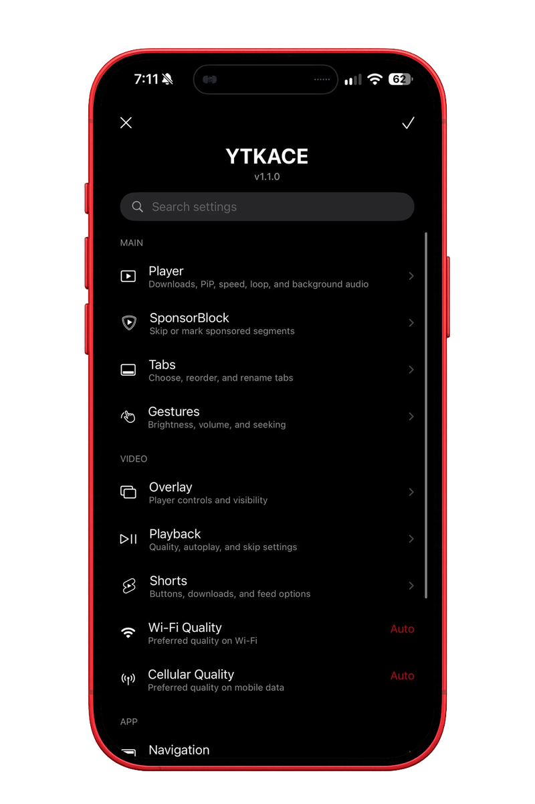
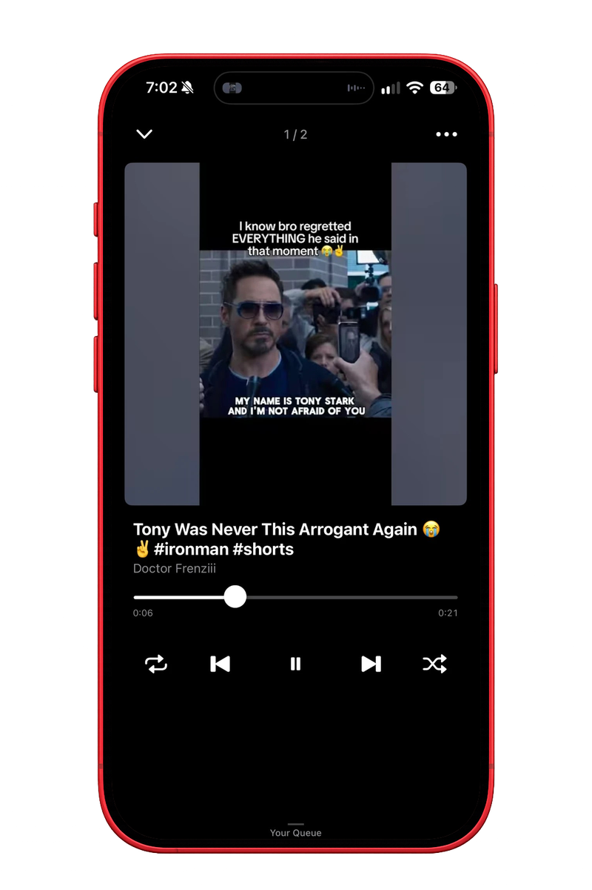
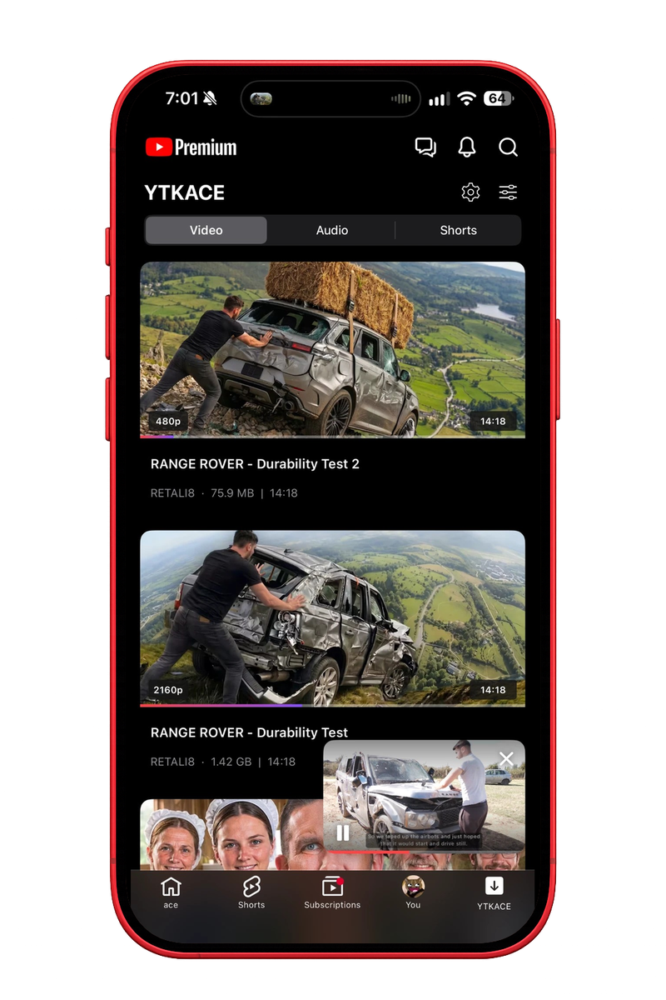
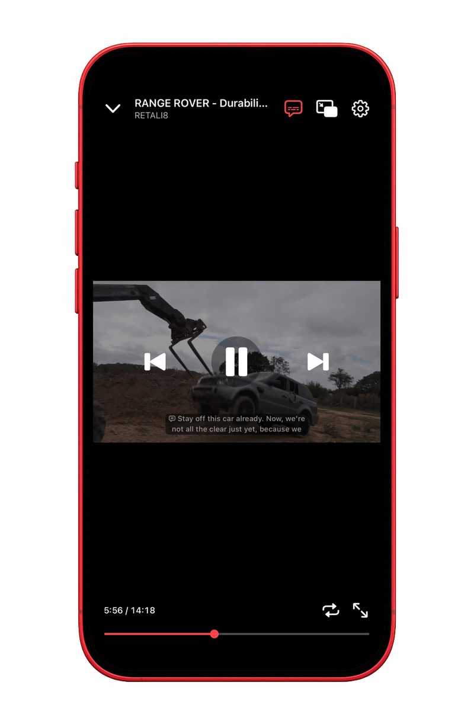
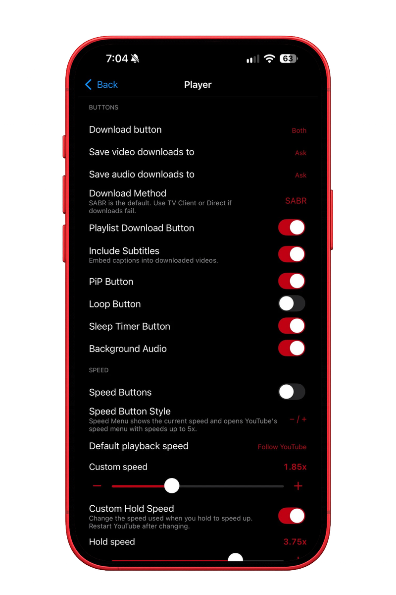
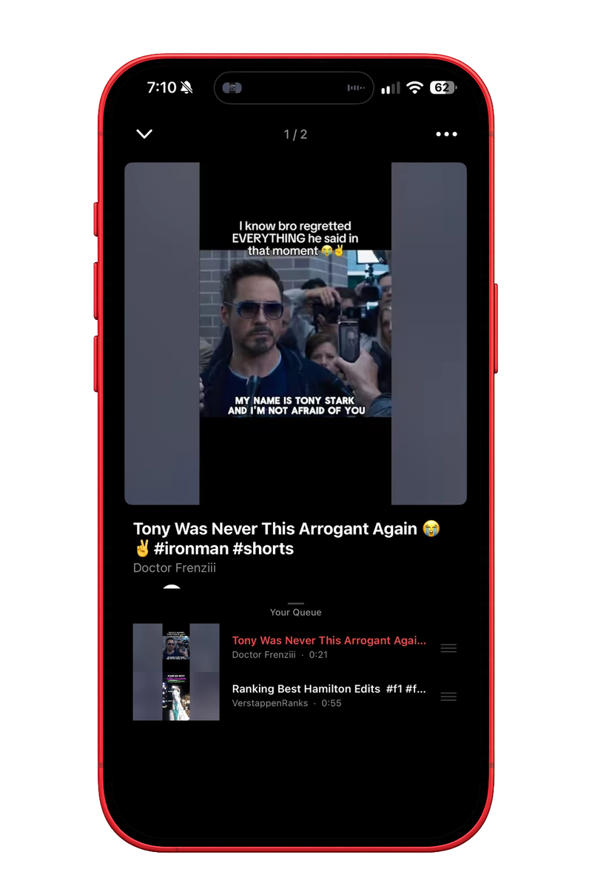

# YTKACE

An open-source YouTube enhancement for iOS.

## Features

| Area | Included |
|---|---|
| Downloads | Video, audio and Shorts downloads; queues; sorting; backup and restore |
| Playback | Background playback, PiP, loop, speed controls, default speed, gestures, tap to seek, and Simplified Chinese auto-translate |
| SponsorBlock | Category controls, progress markers, skip modes and configurable alerts |
| Interface | OLED mode, overlay controls, navigation cleanup and native share sheets |
| Tabs | Hide, reorder and add YouTube destinations |
| Library | Downloaded video, Shorts and audio players with resume support |
| Settings | Searchable settings, 15 languages and a native YouTube settings section |

## Compatibility

- **iOS:** 16.0 and newer
- **Architecture:** arm64
- **YTKACE:** 0.9.3

YouTube 21.36.6 requires iOS 17, so two IPAs are published:

| IPA | YouTube base | iOS |
| --- | --- | --- |
| `YTKACE_0.9.3_YouTube_iOS16_21.33.6.ipa` | 21.33.6 | 16.0 and newer |
| `YTKACE_0.9.3_YouTube_21.36.6.ipa` | 21.36.6 | 17.0 and newer |

Pick the 21.36.6 build unless you are on iOS 16. Either one installs with TrollStore or a developer-certificate sideloader.

## Install

**Jailbroken.** Add the repository in Sileo, Zebra or Cydia:

```
https://itzzace.github.io/ytkace/
```

Rootless and roothide packages are both published. The repository page also has an
[Add to Sileo](https://itzzace.github.io/ytkace/) button.

**Sideloaded.** Download the IPA for your iOS version from the [latest release](https://github.com/oexi/ytkace/releases/latest) and install it with TrollStore, AltStore, SideStore or LiveContainer.

**AltStore source.** Add this URL in AltStore's Sources tab:

```
https://github.com/oexi/ytkace/releases/latest/download/altstore-source.json
```

The IPA workflow publishes or refreshes the matching GitHub Release and regenerates this AltStore source automatically from the built IPA metadata.

## Build

Fork the repository, enable Actions, open the **IPA** workflow and provide a direct link to a decrypted YouTube IPA you are legally allowed to use. The completed workflow provides the injected IPA as an artifact. The **Deb** workflow builds the tweak package.

To build both IPAs in one run, fill in the second URL field as well: the workflow takes an iOS 16 base (21.33.6) and an optional iOS 17+ base (21.36.6), and uploads them as separate artifacts. Leaving the second field empty builds a single IPA. Successful runs also create or update the `v<YTKACE version>` release, attach the IPA files, and publish `altstore-source.json` as a release asset.

## Settings

Open the YTKACE tab and tap the gear, or open YouTube Settings and choose YTKACE.
Both pages carry the same options, and the YouTube Settings section has a search bar.

## Screenshots

<p align="center">
  
  
  
</p>

<p align="center">
  <sub>Settings · Downloads · Audio Player</sub>
</p>

<details>
  <summary>More screenshots</summary>
  <br>
  <p align="center">
    
    
    
  </p>
  <p align="center">
    
    
    
  </p>
  <p align="center">
    
    
  </p>
</details>

## Privacy

YTKACE has no activation service, analytics, telemetry or updater.

## Notes

A set of copying claims about this project was made in public. One of them was true.

The playback fix that shipped after 0.8.0 was taken from another project. That is on me, and it has since been removed from YTKACE entirely.

The rest does not hold up. The translation files were not copied, and you can check that yourself: download both projects' string files from GitHub and compare them. The SABR code here was written for this project.

The code before 0.8.0 is a fair criticism. The interface looked much like iKarwan's even though it was built differently, and when people asked about it I said nothing. I should have.

From 0.9.0 onward there is nothing here from another project.

iKarwan, I should have brought this to you privately instead of letting it play out in public. If something of yours is still in here, point at it and I will remove it.

## License

YTKACE source is available under the [MIT License](LICENSE). See [Third-Party Notices](THIRD_PARTY_NOTICES.md) for components and services with separate terms.
